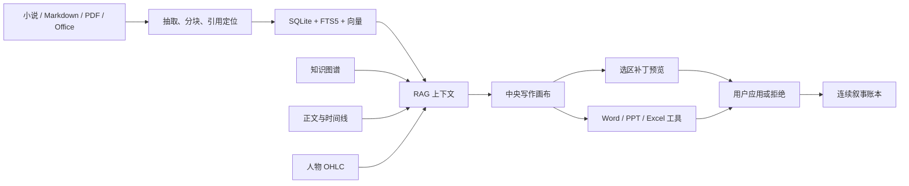

# Creative Claw

面向长篇创意写作的本地优先工作台：把正文编辑、局部 AI 改写、RAG 知识库、人物关系、故事时间线、人物 OHLC K 线和可验证叙事账本放在同一个画布中。

> 当前状态：Alpha / 可运行原型。默认完全离线；只有主动配置模型或远程嵌入服务时才会发起外部请求。

## 为什么是 Creative Claw

普通聊天框擅长生成一段文字，却很难持续维护几十章之后的事实、人物状态与修改来源。Creative Claw 把“写作”视为一个可检索、可计算、可审阅的工程：

- **中央正文编辑器**：完整场景正文留在画布中央，不被 AI 对话淹没。
- **IDE 式局部修改**：选中一个字符区间或段落，让 AI 只改选区；应用前并排查看原文与替换文本。
- **本地 RAG**：SQLite + FTS5 全文检索、离线哈希向量、实体关系扩展、时间邻近度与正典状态共同排序，并保留引用定位。
- **人物 K 线**：场景级 `Open / High / Low / Close` 可手工录入和拖动，细周期自动聚合到集/章等父周期。
- **连续叙事账本**：事实、正文补丁、时间线、K 线、Office 写入和智能体执行形成哈希连续的追加式记录。
- **知识图谱与时间线**：人物、地点、事实、方法和来源用带证据的关系连接，正典与支线隔离。
- **可审批工具调用**：Word、PowerPoint、Excel 的创建和修改在落盘前暂停，等待用户批准。
- **OpenAI-compatible 模型**：可接 MiniMax 或其他兼容 `/chat/completions` 的服务；密钥以明文保存在数据库同目录的 `*.llm.json`，不写入 HTML、SQLite 或浏览器存储。

## 3 分钟启动

要求：Python 3.11+。首次运行需要联网下载 Python 依赖，之后本地知识库可离线使用。

### Windows 一键启动

双击 `start.bat`，或在 PowerShell 中运行：

```powershell
.\start.ps1
```

脚本会自动创建 `.venv`、安装依赖、创建自包含演示项目、打开浏览器并在 <http://127.0.0.1:8766/> 启动画布。重复运行不会重复创建演示数据。

### macOS / Linux 一键启动

```bash
chmod +x start.sh
./start.sh
```

服务器环境可禁止自动打开浏览器：

```bash
NO_BROWSER=1 HOST=0.0.0.0 PORT=8766 ./start.sh
```

### Docker Compose

```bash
docker compose up --build
```

打开 <http://127.0.0.1:8766/>。SQLite 数据和项目目录保存在 `creative-claw-data` 命名卷中；升级或重启容器不会丢失。

```bash
docker compose down             # 停止，保留数据
docker compose down --volumes   # 停止并删除演示数据
```

Docker 不是必需项。Windows/macOS/Linux 脚本和 Docker 都调用同一个 `examples/bootstrap_demo.py`，所以行为一致。

## 启动后能看到什么

内置演示只使用仓库中的 `story-sources/E18-S08-喜剧续写正典.md`，不依赖作者电脑上的私人文档。它会创建：

- E18-S07、E18-S08 两段可编辑正文；
- 沈霜、齐尧、人物 K 线与连续叙事账本实体，以及两条关系；
- 沈霜“知情度”的场景 OHLC；
- 从场景自动聚合的 E18 父周期：`O=42 H=88 L=38 C=79`；
- 一份带引用的正典资料与一条可通过校验的叙事账本。

人物 K 线的数值不是从文本自动臆测的情绪分数，而是作者明确维护的类型化数据。例如：

| 周期 | Open | High | Low | Close | 父周期 |
| --- | ---: | ---: | ---: | ---: | --- |
| E18-S01 | 42 | 50 | 38 | 47 | E18 |
| E18-S02 | 47 | 58 | 45 | 55 | E18 |
| E18-S03 | 55 | 81 | 52 | 76 | E18 |
| E18-S08 | 76 | 88 | 61 | 79 | E18 |

父周期采用确定性规则：第一条的 Open、所有子周期最大的 High、最小的 Low、最后一条的 Close。OHLC 只记录区间摘要，场景内事件顺序仍由正文和有序节拍表达。

## 配置大模型

不配置模型也能浏览/编辑画布、使用本地 RAG、维护图谱/K 线/账本和执行显式工具计划。若要使用 AI 对话、蓝图抽取或选区改写，可在页面顶部配置；正常化后的 `api_key`、`base_url` 和 `model` 会以明文写入当前数据库同目录的 `*.llm.json`。该文件位于已被 `.gitignore` 忽略的 `.creative-claw/` 运行目录，API 响应不会回显密钥。

也可以在启动前设置环境变量：

```powershell
$env:CREATIVE_CLAW_LLM_BASE_URL="https://api.minimaxi.com/v1"
$env:CREATIVE_CLAW_LLM_MODEL="MiniMax-M3"
$env:CREATIVE_CLAW_LLM_API_KEY="your-key"
.\start.ps1
```

macOS/Linux 使用 `export`。Docker 用户复制示例配置后再启动：

```bash
cp .env.example .env
# 编辑 .env；不要提交该文件
docker compose up --build
```

嵌入服务是可选的：设置 `CREATIVE_CLAW_EMBEDDING_BASE_URL`、`CREATIVE_CLAW_EMBEDDING_MODEL` 和 `CREATIVE_CLAW_EMBEDDING_API_KEY` 即可。远程嵌入失败时自动退回离线哈希向量，不会使知识库整体不可用。

> 如果 API Key 曾经出现在聊天、截图、Issue 或 Git 历史中，请先在提供商控制台撤销并轮换，不要继续使用原密钥。

## AI 冷启动框架搭建

空项目可以直接从一句创作意图建立轻量故事骨架：

1. 在右侧 **AI 助手** 的工作模式中选择 **冷启动框架搭建**。
2. 输入一句话，例如“帮我写一个类阿凡提的幽默故事”。
3. 点击 **生成框架预览**，审阅故事标题、梗概、3–5 个实体、必要关系、6–8 个场景卡和主人公 K 线。
4. 点击 **采用全部**，一次性写入画布；预览阶段不会修改项目。

冷启动只允许用于没有资料、实体、关系、场景、K 线、生产单元或交付物的空项目。采用时服务端会再次检查，若项目已产生内容则返回 `409`；标题、实体、关系、场景、K 线和 `cold_start.applied` 账本事件在同一个 SQLite 事务中提交，任一步失败都会整体回滚。

模型只生成场景卡级摘要，不直接生成完整正文。遇到“类某作品或人物”的要求时，只允许使用机智反转、民间幽默、讽刺权威等抽象机制，不复刻专有名称、完整情节、标志性台词或连续表达。

专用 API：

```text
POST /v1/projects/<project_id>/cold-start/preview
{"prompt":"一句创作意图"}

POST /v1/projects/<project_id>/cold-start/apply
{"preview":{...},"generation":{"prompt":"...","model":"..."}}
```

聚焦验证命令：

```powershell
.\.venv\Scripts\python.exe -m unittest tests.test_cold_start tests.test_cold_start_api -v
node --test tests/js/cold-start-state.test.cjs
.\.venv\Scripts\python.exe scripts\e2e_cold_start.py --port 8769 --fake-model-port 8770 --output-dir demo-output\cold-start
```

## 工作方式



账本借鉴的是“历史连续、可验证、不能静默改写”的思路，不是加密货币或分布式区块链。正文、结构化事实和 K 线仍保存在适合编辑、搜索和聚合的普通数据表中；账本负责证明修改历史的连续性。

## 建立自己的知识库

一键脚本用于体验演示。命令行可创建独立项目并导入自己的资料：

```bash
creative-claw --db .creative-claw/my-story.db init --id my-story --name "我的长篇" --root ./my-story
creative-claw --db .creative-claw/my-story.db import --project my-story ./references --canon-status reference
creative-claw --db .creative-claw/my-story.db documents --project my-story
creative-claw --db .creative-claw/my-story.db search --project my-story "主角何时知道真相"
creative-claw --db .creative-claw/my-story.db stats --project my-story
creative-claw --db .creative-claw/my-story.db ledger --project my-story
creative-claw --db .creative-claw/my-story.db serve --port 8766
```

支持 TXT、Markdown、JSON、HTML、常见源码、PDF、DOCX、PPTX、XLSX、CSV、TSV。引用会尽可能保留页码、幻灯片、工作表/行、段落、表格以及集/场等定位信息。

维护命令：

```bash
creative-claw --db .creative-claw/my-story.db reindex --project my-story DOCUMENT_ID
creative-claw --db .creative-claw/my-story.db embeddings --project my-story --replace
creative-claw --db .creative-claw/my-story.db delete-document --project my-story DOCUMENT_ID
```

`delete-document` 只删除索引记录，绝不删除磁盘上的源文件。

## API

服务同时提供 JSON API，常用入口包括：

| Method | Endpoint | Purpose |
| --- | --- | --- |
| GET | `/health` | 健康检查 |
| GET/POST | `/v1/projects` | 项目列表/创建项目 |
| GET | `/v1/projects/{id}/canvas` | 一次读取画布结构化快照 |
| POST | `/v1/projects/{id}/documents/upload` | 上传并索引资料 |
| POST | `/v1/projects/{id}/search` | 混合检索 |
| POST | `/v1/projects/{id}/context` | 生成带图谱、时间线和 OHLC 的上下文 |
| POST | `/v1/projects/{id}/chat` | RAG 写作对话/局部改写 |
| GET | `/v1/projects/{id}/ledger/verify` | 校验账本连续性 |

查看完整可用工具：

```bash
creative-claw tools
```

## 数据、备份与隐私

- 本地脚本默认数据库：`.creative-claw/demo.db`。
- Docker 默认数据库：卷内 `/data/creative-claw.db`。
- 最简单的备份是在服务停止后复制 SQLite 数据库；运行中备份建议使用 SQLite backup API。
- 数据库可能包含完整文稿、人物关系、引用、模型输出与修改历史，请按敏感创作资料保护。
- 本地模式默认仅监听 `127.0.0.1`。对公网监听前请自行增加认证、TLS 和访问控制。

运行数据、`.env`、数据库、生成的 Office 文件和缓存均已写入 `.gitignore`，不会作为开源代码提交。

## 开发与验证

```bash
python -m pip install -e .
python -m compileall -q creative_claw examples tests
python -m unittest discover -s tests -v
node --check creative_claw/web/app.js
```

GitHub Actions 会在 Python 3.11 和 3.12 上运行回归测试，并从空数据库验证仓库内置演示初始化。

## 开源与 GPL 边界

Creative Claw 按 [MIT License](LICENSE) 发布。实现为 clean-room：没有复制 Vela 或任何 GPL 项目的源码、测试、资源、提示词或文档，也不依赖 GPL-3.0 运行库。Vela 仅作为公开产品行为参考。直接依赖的许可证列表见 [LICENSES.md](LICENSES.md)。

这意味着可以研究“本地知识库、RAG、引用、工具调用”等通用产品能力，但贡献代码仍必须独立实现。详细规则见 [CONTRIBUTING.md](CONTRIBUTING.md)。

## 当前限制与 Roadmap

- Alpha 版本尚未内置用户认证，不应直接裸露到公网。
- Office 能力操作 OOXML 文件本身，不控制桌面版 Microsoft Office，也不支持旧格式 `.doc/.ppt/.xls`。
- 扫描 PDF 暂无 OCR；复杂 Office 模板不保证像素级保真。
- 后续重点：更多层级的时间周期编辑、更强的冲突检测、可插拔嵌入/重排器、插件协议、项目导入导出与多人协作。

欢迎通过 Issue 描述可复现问题，通过 Pull Request 提交独立实现。安全问题请遵循 [SECURITY.md](SECURITY.md)，不要公开泄露文稿或密钥。


## Phase 1：上下文与真实联动（已部署 2026-07-29）

### 变更文件

| 状态 | 路径 | 说明 |
|------|------|------|
| + | `creative_claw/context.py` | 统一 ContextScope 与兼容请求解析 |
| + | `creative_claw/evidence.py` | 七类类型化证据编号与引用校验 |
| + | `creative_claw/web/context-state.js` | 浏览器纯函数上下文模块 |
| M | `creative_claw/repository.py` | 精确场景查询、邻域时间线、关联 K 线 |
| M | `creative_claw/retrieval.py` | scope 兼容解析、当前场景/时间线/K 线自动加载、类型化证据生成 |
| M | `creative_claw/llm.py` | 系统提示改用 [S#]/[G#]/[T#]/[K#] 引用规则 |
| M | `creative_claw/api.py` | /context、/chat 新增 resolved_scope、evidence_refs、citation_validation |
| M | `creative_claw/web/index.html` | 加载 context-state.js，增加预览按钮与上下文对话框 |
| M | `creative_claw/web/app.js` | 移除全部“沈霜/知情度”硬编码；先预览后调用；类型化证据；K 线跟随选择 |
| M | `creative_claw/web/app.css` | 预览、工序提醒、证据徽标和引用警告样式 |
| + | `tests/test_context_scope.py` | ContextScope 与 Repository 场景上下文单元测试 |
| + | `tests/test_evidence.py` | 证据编号与引用校验单元测试 |
| + | `tests/test_context_api.py` | API 契约测试（含 mock 模型） |
| + | `tests/js/context-state.test.cjs` | 浏览器上下文纯函数 Node 测试（9 项） |
| + | `tests/test_real_llm.py` | 真实模型验证（默认跳过，需 CREATIVE_CLAW_REAL_LLM_TEST=1） |
| + | `scripts/e2e_context_preview.py` | 浏览器端到端验收脚本 |

### 验收结果

- Python 编译：`compileall` 通过
- Python 单元测试：25 项通过（含原有 8 项 0 回归）
- Node 单元测试：9 项全部通过
- JavaScript 语法检查：`context-state.js`、`app.js` 均通过
- 硬编码扫描：`app.js` 无 `character_name: "沈霜"` 或 `dimension: "知情度"`
- 浏览器 E2E：两组人物/场景/维度切换全部通过（顾遥/信任度、林川/决心）
- 工序提醒：“确认上下文 → 运行模型 → 审阅候选 → 接受或拒绝”可见
- 类型化证据：`[S#] [G#] [T#] [K#]` 编号互不混用
- 真实模型测试：默认跳过，未消耗费用；显式启用时密钥不进入源码或报告
- 密钥扫描：无 API Key 泄漏

### 已知边界（后续阶段处理）

- 三模式前端尚未重构（Phase 3）
- 首次建项向导尚未实现（Phase 4）
- 影响中心尚未实现（Phase 5）
- 引用校验只判断编号存在性，不验证语义蕴含

### 建议提交信息

```
feat: complete phase 1 context linkage
```

注意：当前目录不是 Git 仓库，以上提交信息仅作为记录。

## Phase 2.5：参考机制蓝图迁移与差异化草稿（已实现 2026-07-29）

“蓝图实验室”允许作者粘贴一篇短文本或整部长篇，先生成可编辑的参考创作机制蓝图，再把抽象机制迁移到新人物、新世界和新冲突中。结构化目标设定必须由作者编辑并显式确认后才能迁移；迁移得到的目标生产蓝图也必须由作者确认，系统才允许按生产单元生成草稿候选。

核心安全边界：

- schema v5 新增蓝图任务、批次、代理运行、节点、证据、解释、冲突、边、结构化新设定、映射、候选和相似度记录；v4 数据、OHLC 与旧账本原样保留。
- 参考抽取由确定性 DAG 编排专业代理。20,000 字符以内默认同步；更长文本按约 12,000 字符、最多 800 字符重叠持久化分批，可暂停、恢复、取消，服务重启后不自动产生模型费用。
- 长篇节点使用显式 `key_scope: batch | global`：局部 key 自动规范为 `batch:<ordinal>:<raw-key>`，父子、边、解释和冲突引用同步重映射；显式全局节点可跨批合并，作用域、类型或父级冲突会阻止发布，不再静默覆盖后批结构。
- 长篇综合具有真实屏障：所有批次先完成局部抽取和章级综合，随后依次执行卷级、作品级与最终冲突归并。全局阶段只接收经过原文片段清洗的类型化节点、维度和证据元数据，并只能复用白名单内的既有证据 id。
- 蓝图层级支持 `work → volume/phase → chapter/episode → scene → beat`，并兼容省略可选上层的 `work → chapter/episode`。
- 所有 23 个蓝图维度都必须明确为 `observed`、`not_observed` 或 `uncertain`。observed/uncertain 结论保留绝对字符证据范围、置信度和 agent run；歧义同时保留多个解释与冲突组。
- 新设定从自然语言整理为可编辑结构；迁移代理只读取抽象后的叙事功能、因果与 K 线等机制，不读取参考 quote、稀有短语或抽取代理原始回复。
- `DraftContextBuilder` 使用 allowlist。草稿代理只能读取确认后的目标设定、目标蓝图、生产单元、目标正典和已接受目标文本；发现 reference provenance 会在模型调用前拒绝并写入安全账本事件。
- 相似度门禁分三层：24 个中文字符/80 个 Latin 字符连续复制、5-gram + LCS 和稀有短语命中会硬阻止；70% 独特 ordered beats 一一对应且 transform 低于 30% 时要求整改；抽象母题和目标—阻碍—结果机制相似允许。
- AI 只创建 candidate。`passed` 候选由作者接受后才生成新的正式 artifact version；拒绝、blocked 和 review_required 都不修改正式稿。
- API Key 以明文保存到数据库同目录的 `*.llm.json`，但不在 API 响应、日志或浏览器存储中回显；自动测试默认使用 deterministic agents，真实模型只在显式设置 `CREATIVE_CLAW_REAL_LLM_TEST=1` 时调用。

Phase 2.5 API：

```text
POST /v1/projects/{project_id}/blueprint-jobs/reference
GET  /v1/projects/{project_id}/blueprint-jobs/{job_id}
POST /v1/projects/{project_id}/blueprint-jobs/{job_id}/pause|resume|cancel
POST /v1/projects/{project_id}/reference-blueprints/manual
GET  /v1/projects/{project_id}/reference-blueprints/{artifact_id}
POST /v1/projects/{project_id}/reference-blueprints/{artifact_id}/versions
POST /v1/projects/{project_id}/target-settings
POST /v1/projects/{project_id}/target-settings/{artifact_id}/confirm
POST /v1/projects/{project_id}/blueprint-jobs/migration
POST /v1/projects/{project_id}/target-blueprints/manual
GET  /v1/projects/{project_id}/target-blueprints/{artifact_id}
POST /v1/projects/{project_id}/target-blueprints/{artifact_id}/confirm
POST /v1/projects/{project_id}/draft-candidates
GET  /v1/projects/{project_id}/draft-candidates/{candidate_id}
POST /v1/projects/{project_id}/draft-candidates/{candidate_id}/accept|reject
```

蓝图响应默认不返回 evidence quote；只有显式传 `include_evidence=1&include_quotes=1` 才返回引用文本。任务响应从不回传完整参考正文，只返回哈希、字符数、状态和进度。

验证命令：

```powershell
.\.venv\Scripts\python.exe -m compileall -q creative_claw tests scripts
.\.venv\Scripts\python.exe -m unittest discover -s tests -v
node --test tests/js/*.test.cjs
node --check creative_claw/web/context-state.js
node --check creative_claw/web/blueprint-state.js
node --check creative_claw/web/app.js
.\.venv\Scripts\python.exe scripts\e2e_context_preview.py
.\.venv\Scripts\python.exe scripts\e2e_blueprint_lab.py
```

2026-07-29 最终新鲜验收：Python 117 项（116 通过，1 项付费真实模型按设计跳过），Node 16/16，Python 编译与三份 JavaScript 语法检查通过；Phase 1 上下文 E2E 和 Phase 2.5 蓝图 E2E 均为 `passed=true`、`page_errors=[]`。凭据、E2E 报告正文、draft request allowlist 与浏览器存储扫描全部通过。`CREATIVE_CLAW_REAL_LLM_TEST=0`，未产生模型费用。

已知边界：首版是本地单用户执行器，不包含云队列与多人协作；确定性 fake agents 仅用于无费用测试，生产自动抽取仍需配置 OpenAI-compatible 模型；三模式前端、首次向导和影响中心继续由 Phase 3–5 完成。

建议提交信息：

```text
feat: add orchestrated reference blueprint migration and safe drafting
```

注意：当前目录不是 Git 仓库，没有自动初始化或提交。

## Phase 2：生产工作流内核（已部署 2026-07-29）

Phase 2 在不删除旧表的前提下把数据库升级到 schema v4，并新增媒介无关的生产对象：工作流模板、项目工作流、阶段、生产单元、交付物、交付物版本、依赖、审阅、审阅问题和影响记录。

### 稳定行为

- 内置 `novel` 长篇小说模板（13 阶段）和 `vertical_short_drama` 竖屏短剧模板（16 阶段）。
- 一个项目可实例化一套模板；阶段保留稳定顺序、进入条件、完成标准和状态。
- 生产单元支持 `work / volume / chapter / episode / act / scene / sequence / beat / quest / branch`，父子单元必须属于同一项目和分支。
- 阶段只能通过服务层状态机变更；required artifact 未批准时不能通过，跳过必须记录理由，锁定后不可继续变更。
- 正式保存永远创建新的 `artifact_versions` 行，不覆盖历史版本；过期的 `expected_current_version_id` 返回 HTTP 409，且不会留下部分写入或账本事件。并发保存会在版本检查前串行化写事务，两个相同基础版本的请求稳定得到一次成功和一次 409，不泄漏 SQLite 唯一约束错误。
- 依赖图拒绝 self-edge、跨项目边和环路。上游版本变化会沿依赖图递归生成影响记录、把相关有效审阅标记为 `stale`，并把未锁定下游交付物标记为 `stale`；下游正文内容不会被自动改写。
- 版本、审阅过期、影响记录和账本事件在同一个 SQLite 事务内完成；账本哈希算法保持不变。
- 所有 Phase 2 能力不依赖模型配置，可以纯手工和纯本地运行。

### schema v4 兼容迁移

- 保留 `projects`、`documents`、`chunks`、`entities`、`relations`、`timeline_events`、`ohlc_points`、`ledger_events`、`tasks` 和 `tool_runs`。
- 旧 `document` 幂等映射为 `source` artifact 和初始正式版本。
- 旧 `timeline_event` 幂等映射为 `scene` production unit、`manuscript` artifact 和初始版本。
- 旧 OHLC 与 timeline link 保持原值；迁移不新增、不删除、不重写旧账本事件，因此原哈希链继续有效。

### HTTP API

```text
GET  /v1/workflow-templates
POST /v1/projects/{project_id}/workflow
GET  /v1/projects/{project_id}/workflow
POST /v1/projects/{project_id}/production-units
POST /v1/projects/{project_id}/workflow-stages/{stage_id}/transition
POST /v1/projects/{project_id}/artifacts
GET  /v1/projects/{project_id}/artifacts/{artifact_id}
POST /v1/projects/{project_id}/artifacts/{artifact_id}/transition
POST /v1/projects/{project_id}/artifacts/{artifact_id}/versions
GET  /v1/projects/{project_id}/artifacts/{artifact_id}/versions
POST /v1/projects/{project_id}/artifact-dependencies
POST /v1/projects/{project_id}/reviews
GET  /v1/projects/{project_id}/impacts?status=open
```

正式版本写入示例：

```json
{
  "content": "修订后的正式内容",
  "expected_current_version_id": "ver_...",
  "change_summary": "调整第一幕正典",
  "source_kind": "user"
}
```

成功响应包含新 `artifact`、新 `version` 和 `sync`；`sync` 列出 `stale_review_ids`、`impact_ids` 与 `affected_artifact_ids`。

Phase 2 写端点只接受 JSON object；数组、空正文和 malformed JSON 均返回 JSON 格式的 HTTP 400。未知项目或对象返回 JSON 格式的 HTTP 404。影响列表同时返回来源/目标标题、版本变更摘要和可读中文 `summary`。

### 变更文件

| 状态 | 路径 | 说明 |
|------|------|------|
| + | `creative_claw/workflow_templates.py` | 两个内置媒介模板与稳定阶段定义 |
| + | `creative_claw/workflow.py` | 工作流、版本、依赖、审阅与影响领域服务 |
| M | `creative_claw/db.py` | schema v4、新表、索引和旧数据幂等迁移 |
| M | `creative_claw/ledger.py` | 支持复用领域事务写入不可变事件 |
| M | `creative_claw/repository.py` | Phase 2 结构化对象统计 |
| M | `creative_claw/api.py` | Phase 2 HTTP 契约与 409 版本冲突 |
| + | `tests/test_workflow_migration.py` | 模板种子、legacy 映射、幂等与账本保真 |
| + | `tests/test_workflow.py` | 阶段、单元、版本、依赖、审阅与影响规则 |
| + | `tests/test_workflow_api.py` | 无模型生产链、UTF-8 与冲突回滚 API 测试 |
| + | `docs/superpowers/plans/2026-07-29-phase2-production-workflow-kernel.md` | Phase 2 可复现实施计划 |

### 验证命令

```powershell
.\.venv\Scripts\python.exe -m compileall -q creative_claw tests
.\.venv\Scripts\python.exe -m unittest discover -s tests -v
node --test tests/js/*.test.cjs
node --check creative_claw/web/context-state.js
node --check creative_claw/web/app.js
```

真实模型测试仍只有在 `CREATIVE_CLAW_REAL_LLM_TEST=1` 时运行，Phase 2 自动测试不消费模型费用。

2026-07-29 最终验收：Python 38 项（37 通过、1 项付费真实模型按设计跳过），Node 9/9；Python 编译、两份 JavaScript 语法检查、浏览器两组上下文预览、迁移/账本回归和凭据扫描均通过。

### 后续边界

- Phase 3：写作 / 结构 / 审阅三模式和独立正文编辑器。
- Phase 4：首次建项向导、阶段编辑器、工序助手和引导密度。
- Phase 5：面向用户的影响中心、锁稿条件、例外、导出与完整工业化验收。
- Phase 2 已提供影响记录后端与查询 API，但没有提前实现 Phase 5 的影响中心 UI。

### 建议提交信息

```text
feat: complete phase 2 production workflow kernel
```

注意：当前目录不是 Git 仓库，以上提交信息仅作为记录。

